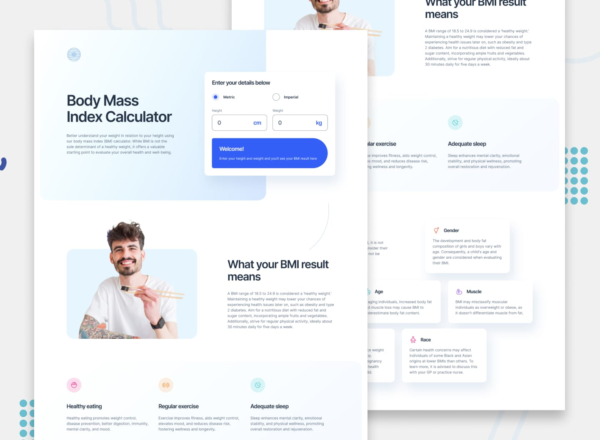

# Frontend Mentor - Body Mass Index Calculator solution

This is my solution to the [Body Mass Index Calculator challenge](https://www.frontendmentor.io/) on Frontend Mentor. These challenges help improve front-end skills by building realistic projects and documenting implementation decisions in a more meaningful way.

## Table of contents

- [Overview](#overview)
  - [The challenge](#the-challenge)
  - [Screenshot](#screenshot)
  - [Links](#links)
- [My process](#my-process)
  - [Built with](#built-with)
  - [Key implementations](#key-implementations)
  - [What I’m proud of](#what-im-proud-of)
  - [Challenges I faced](#challenges-i-faced)
  - [What I would do differently](#what-i-would-do-differently)
  - [Continued development](#continued-development)
- [Author](#author)

## Overview

### The challenge

Users should be able to:

- Switch between Metric and Imperial units
- Receive instant BMI calculations based on their inputs
- View their BMI classification
- See a healthy weight range based on their height
- Experience an optimal layout across mobile, tablet, and desktop screen sizes
- Interact with clear hover and focus states for form controls

### Screenshot

### Links

- Solution URL: [Frontend Mentor Solution](https://www.frontendmentor.io/solutions/bmi-caculatorreacttailwindcss-1tXzKyMehZ)
- Live Site URL: [Live Site](https://bmicalculator-k.netlify.app/)

## My process

### Built with

- Semantic HTML5 markup
- React
- Vite
- Tailwind CSS v4
- CSS Grid
- Flexbox
- Mobile-first workflow

### Key implementations

One of the main goals of this project was not only to build the calculator logic, but also to create a reusable and organized styling system around the provided Figma design.

- **Custom design system with Tailwind CSS v4**  
  Instead of using only default Tailwind utilities, I extended the framework with custom tokens and semantic utilities to better match the visual language of the design.

- **Project-specific theme tokens**  
  I defined custom values inside `@theme` for typography and colors, including the `Inter` font family and a full palette with reusable variables such as `Blue-900`, `Blue-500`, `Grey-500`, `Gradient-1`, and `Gradient-2`.

- **Reusable typography presets**  
  I created custom text utilities such as `preset-1`, `preset-2`, `preset-4`, `preset-5`, `preset-6`, and `preset-7-Regular` to better represent the challenge typography system. This helped keep the JSX cleaner and made the text scale easier to maintain.

- **Semantic UI utilities**  
  I also created reusable utility classes such as `check`, `inputText`, and `sshadow` for common interface elements like custom radio inputs, text fields, and elevated containers. This reduced repetition and improved consistency across the UI.

- **Responsive layout structure**  
  I used Grid, Flexbox, and a mobile-first workflow to recreate the layout across multiple breakpoints while preserving spacing, hierarchy, and readability.

- **Real-time BMI calculations**  
  The application updates the BMI result dynamically as soon as the user provides valid values.

- **Healthy range calculation**  
  In addition to the BMI score, the app calculates and displays the recommended healthy weight range according to the user's height and selected measurement system.

### What I’m proud of

I’m proud of the high fidelity I achieved compared to the Figma design, especially in the “Limitations of BMI” section. I recreated the asymmetric layout with CSS Grid using `grid-cols-12` and `col-start`, which allowed me to match the composition much more accurately than a Flexbox approach.

### Challenges I faced

The decorative background was tricky at first because my initial solution broke on large screens. I fixed it by using viewport-based absolute positioning so the gradient could extend responsively without affecting the layout.

I also had to refactor the desktop structure from Flexbox to a 12-column grid to support the staggered mosaic layout required by the design.

### What I would do differently

Next time, I would plan decorative elements and semantic structure earlier so I can balance visual fidelity, accessibility, and maintainability from the beginning.

### Continued development

In future projects, I want to continue improving in these areas:

- Building more scalable design systems with Tailwind CSS v4
- Writing cleaner and more reusable React components
- Improving accessibility in interactive form-based interfaces
- Creating more polished responsive layouts with better spacing and consistency

## Author

- GitHub - [Kevin-AC](https://github.com/Kevin-AC)
- Frontend Mentor - [@Kevin-AC](https://www.frontendmentor.io/profile/Kevin-AC)
